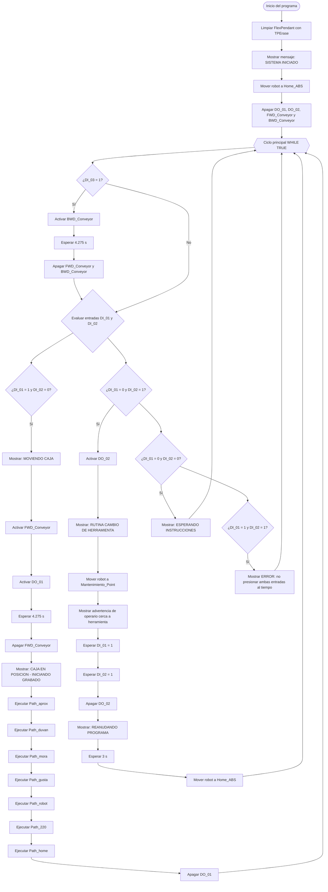

<div align="center">

<!-- ═══════════════════════  COSMIC HEADER  ═══════════════════════ -->

 
  


<!-- ═══════════════════════  BADGE ROW  ════════════════════════════ -->

<a href="https://new.abb.com/products/robotics/robotstudio"></a>
<a href="https://new.abb.com/products/robotics/robots/articulated-robots/irb-140"></a>
<a href="https://library.e.abb.com/public/688894b98123f87bc1257cc50044e809/Technical%20reference%20manual_RAPID_3HAC16581-1_revJ_en.pdf"></a>
<a href="https://www.autodesk.com/products/fusion-360"></a>
<a href="./LICENSE"></a>

</div>

---

<div align="center">

```
╔══════════════════════════════════════════════════════════════════╗
║  🌌  Automatización de decorado de tortas — ABB IRB 140          ║
║  Trayectorias  ·  Herramienta  ·  WorkObjects  ·  I/O Digital   ║
╚══════════════════════════════════════════════════════════════════╝
```

</div>

> **Resumen del proyecto:** Práctica de laboratorio del curso *Robótica Industrial 2026-I* donde se diseña, simula y ejecuta con el robot **ABB IRB140** un sistema de decorado automático de tortas. El robot traza los nombres de los integrantes y una decoración personalizada sobre una superficie plana transportada por conveyor, integrando calibración de herramienta, manejo de WorkObjects, programación RAPID intermedia y control de señales digitales de entrada/salida.

---

## 📋 Tabla de contenidos

| # | Sección |
|---|---------|
| 1 | [📘 Descripción detallada de la solución](#-descripción-detallada-de-la-solución) |
| 2 | [🔁 Diagrama de flujo y plano de planta](#-diagrama-de-flujo-y-plano-de-planta) |
| 3 | [⚙️ Funciones RAPID utilizadas](#️-funciones-rapid-utilizadas) |
| 4 | [🛠️ Diseño de la herramienta — *Marker*](#️-diseño-de-la-herramienta--marker) |
| 5 | [🎯 WorkObjects y calibración](#-workobjects-y-calibración) |
| 6 | [🔌 Entradas y Salidas Digitales](#-entradas-y-salidas-digitales) |
| 7 | [🚌 Control del conveyor](#-control-del-conveyor) |
| 8 | [✏️ Diseño de trayectorias](#️-diseño-de-trayectorias) |
| 9 | [🎥 Video de simulación e implementación](#-video-de-simulación-e-implementación) |
| 10 | [🖼 Previews](#-previews) |
| 11 | [🧾 Autores](#-autores) |

---


## 📘 Descripción detallada de la solución

El presente laboratorio tiene como objetivo desarrollar una aplicación de robótica industrial orientada a la simulación del proceso de decoración de una torta virtual, empleando un manipulador industrial ABB IRB 140 y el entorno de programación RobotStudio. La solución propuesta consiste en generar una rutina de movimiento capaz de representar, sobre una superficie plana, los nombres de los integrantes del grupo y una decoración adicional mediante trayectorias continuas ejecutadas por el robot.

La actividad se plantea como una adaptación del proceso de decoración de tortas en la industria alimentaria, donde un robot puede realizar movimientos controlados para depositar material decorativo sobre una superficie. Debido a las condiciones del laboratorio, el proceso se desarrolla de forma virtual y experimental, utilizando una herramienta diseñada para sujetar un marcador o plumón en el flange del robot. Esta herramienta permite simular el trazado de letras y figuras sobre la superficie definida como torta virtual.

La solución se divide en cinco componentes principales:

1. **Definición de trayectorias del robot:**  
   Se programan trayectorias en RAPID utilizando instrucciones de movimiento como `MoveJ`, `MoveL` y, cuando sea necesario, `MoveC`. Estas trayectorias permiten desplazar la herramienta desde una posición inicial de seguridad o `HOME` hasta la zona de trabajo, ejecutar el decorado y regresar nuevamente a la posición inicial. Los movimientos se realizan considerando velocidades dentro del rango establecido para el laboratorio y zonas de aproximación adecuadas para conservar continuidad y precisión durante el trazado.

2. **Diseño y calibración de la herramienta:**  
   Se diseña una herramienta mecánica que permite fijar un marcador al flange del robot ABB IRB 140. Posteriormente, se realiza la calibración del TCP para definir correctamente el punto de trabajo de la herramienta. Este procedimiento se lleva a cabo tanto en RobotStudio como en el robot real, con el fin de comparar los valores obtenidos del `tooldata` y analizar posibles diferencias entre la simulación y la implementación física.

3. **Uso de workobjects:**  
   Se define un sistema de referencia de trabajo o `workobject` asociado a la superficie donde se realizará la decoración. Inicialmente, las trayectorias se desarrollan sobre un cuadrante de trabajo y posteriormente se reutilizan en una nueva ubicación mediante la creación de otro `workobject`. Esto permite adaptar la misma secuencia de movimientos a una posición diferente del pastel, manteniendo la lógica de programación y evitando redefinir todas las trayectorias desde cero.

4. **Manejo de entradas y salidas digitales:**  
   La rutina del robot incorpora el uso de dos entradas digitales y dos salidas digitales. La primera entrada digital permite iniciar la rutina de decorado y activar una luz indicadora durante la ejecución del proceso. La segunda entrada digital lleva el robot a una posición de mantenimiento, donde sea posible instalar o retirar la herramienta de forma segura, apagando además la luz indicadora. Las salidas digitales también se utilizan para señalizar estados del proceso y controlar el sistema externo asociado a la banda transportadora.

5. **Control de la banda transportadora:**  
   Al finalizar el decorado de la torta virtual, una salida digital del controlador se emplea para activar el movimiento de una banda transportadora mediante el variador de frecuencia correspondiente. Esta etapa representa el transporte automático del pastel una vez completado el proceso de decoración. De esta manera, la solución integra no solo el movimiento del manipulador, sino también la interacción del robot con elementos periféricos del entorno industrial.

En conjunto, la solución propuesta permite simular una celda básica de automatización industrial compuesta por un robot manipulador, una herramienta personalizada, una superficie de trabajo definida mediante `workobjects`, señales digitales de entrada y salida, y una banda transportadora. La programación se desarrolla en RAPID, integrando rutinas de movimiento, rutinas de mantenimiento, control de señales digitales y retorno seguro a la posición `HOME`.

El desarrollo del laboratorio permite aplicar conceptos fundamentales de robótica industrial, tales como programación de trayectorias, calibración de herramientas, definición de marcos de referencia, manejo de entradas y salidas digitales, y coordinación entre el robot y dispositivos externos.

---

## 🔁 Diagrama de flujo y plano de planta



Los archivos finales estarán disponibles en:
- `Laboratorio No. 01 - Robótica Industrial ABB IRB140 y RobotStudio/Diagrams/Ensamblaje Planta.pdf` — Plano de planta con ubicación de todos los elementos

---

## ⚙️ Funciones RAPID utilizadas

> Las siguientes instrucciones y procedimientos describen la lógica de programación desde el punto de vista de su **aplicación práctica en banco**, sin exponer el código fuente directamente. Todo lo documentado aquí corresponde fielmente al módulo `Module1.mod` ejecutado en el laboratorio.

### Primitivas de movimiento

<details>
<summary><b>MoveAbsJ — Movimiento articular absoluto</b></summary>

- **Qué hace:** lleva el robot a una posición definida por ángulos articulares exactos (`jointtarget`), independiente del TCP o WorkObject activo.
- **Cómo se aplica:** se usa exclusivamente para las posiciones `Home_ABS` (todos los ejes en 0° excepto eje 5 en 30°) y `Mantenimiento_Point` (eje 1 en 90°). Garantiza que el robot siempre regrese a la misma pose de referencia sin ambigüedades de configuración.
- **Parámetros usados:** `v300` y `v100` según la urgencia; zona `z1`; herramienta `tool0`.

</details>

<details>
<summary><b>MoveL — Movimiento lineal</b></summary>

- **Qué hace:** desplaza el TCP en línea recta manteniendo orientación constante en el espacio cartesiano.
- **Cómo se aplica:** es la instrucción principal de todo el trazado. Se emplea en los procedimientos de aproximación (`Path_aprox`) y en cada uno de los paths de letras y decoración (`Path_D`, `Path_U1`, `Path_V`, `Path_A1`, `Path_N`, `Path_M`, `Path_O`, `Path_R`, `Path_A2`, `Path_G`, `Path_U2`, `Path_s`, `Path_T`, `Path_A3`, `Path_cara`, `Path_ojo1`, `Path_ojo2`, `Path_boca1/2/3`). Cada `MoveL` referencia la herramienta `MarcadorVirtual` y el WorkObject `wobj_JMora`.
- **Parámetros usados:** `v60` mm/s durante el trazado; `v100` en aproximaciones; zona `z1` en todos los casos para máxima precisión de contorno.

</details>

> **Nota:** `MoveC` no fue utilizado en este proyecto. Todas las curvas y contornos se aproximaron mediante secuencias densas de `MoveL` generadas desde Fusion 360, logrando la suavidad requerida sin necesidad de arcos explícitos.

### Control de I/O y temporización

| Instrucción | Función | Aplicación real en el código |
|---|---|---|
| `Set` | Activa una salida digital a 1 | Enciende `FWD_Conveyor` para avanzar la banda y `DO_01` como indicador de ciclo activo |
| `Reset` | Desactiva una salida digital a 0 | Apaga `FWD_Conveyor`, `BWD_Conveyor`, `DO_01` y `DO_02` al inicio y al finalizar cada ciclo |
| `WaitTime` | Pausa la ejecución por un tiempo fijo | Se usa con `4.275 s` para dar tiempo a que la torta viaje hasta la posición de marcado y para la rutina de retroceso del conveyor |
| `WaitDI` | Espera hasta que una entrada digital valga 1 | En la rutina de mantenimiento: el programa queda suspendido hasta que **ambas** entradas `DI_01` y `DI_02` se activen simultáneamente antes de reanudar |
| `TPErase` / `TPWrite` | Borra y escribe mensajes en el FlexPendant | Retroalimentación al operador en cada etapa: inicio, estado del conveyor, posición de la caja, advertencias de seguridad y fin de ciclo |

### Lógica de control: estructura `WHILE TRUE` con `IF/ELSEIF`

El `main()` implementa una **máquina de estados de ciclo continuo** basada en la lectura simultánea de `DI_01` y `DI_02`:

| Estado de entradas | Acción ejecutada |
|---|---|
| `DI_01=1`, `DI_02=0` | Ciclo de producción: enciende conveyor → espera 4.275 s → ejecuta trazado completo → retorna a Home |
| `DI_01=0`, `DI_02=1` | Rutina de mantenimiento: mueve a `Mantenimiento_Point`, emite advertencias, espera confirmación doble (`WaitDI` en ambas entradas) antes de reanudar |
| `DI_01=0`, `DI_02=0` | Estado de espera: muestra mensaje "ESPERANDO INSTRUCCIONES" sin mover el robot |
| `DI_01=1`, `DI_02=1` | Estado de error: muestra mensaje de error, no ejecuta ninguna acción de movimiento |

### Procedimientos / bloques funcionales

| Procedimiento | Rol | Descripción práctica |
|---|---|---|
| `main()` | Supervisor y coordinador | Bucle infinito con lógica de estados según `DI_01`/`DI_02`; gestiona conveyor, trazado y mantenimiento |
| `Path_aprox()` | Aproximación segura | Lleva el robot desde `Target_home` hasta `Target_aprox2` en dos pasos a `v100`; establece la posición de entrada al WorkObject |
| `Path_home()` | Retorno a referencia | Movimiento único a `Target_home`; separa la herramienta de la superficie antes de cualquier desplazamiento largo |
| `Path_duvan()` | Nombre "DUVAN" | Orquesta en secuencia: `Path_D` → `Path_U1` → `Path_V` → `Path_A1` → `Path_N` con paths de transición entre letras |
| `Path_mora()` | Nombre "MORA" | Orquesta: `Path_M` → `Path_O` → `Path_R` → `Path_A2` con sus respectivas transiciones |
| `Path_gusta()` | Nombre "GUSTA" | Orquesta: `Path_G` → `Path_U2` → `Path_s` → `Path_T` → `Path_A3` |
| `Path_robot()` | Decoración tipo robot | Orquesta: `Path_cara` → `Path_ojo1` → `Path_ojo2` → `Path_boca1` → `Path_boca2` → `Path_boca3` |
| `Path_cara/ojo1/ojo2/boca1/2/3` | Sub-trayectorias de la figura | Cada una traza un componente independiente de la decoración usando `MoveL` con `wobj_JMora` |
| `Path_70` … `Path_220` | Transiciones entre letras/figuras | Paths de 2 puntos que elevan la herramienta y la reposicionan en el punto de entrada de la siguiente letra sin trazar |
| `Path_220()` | Cierre del ciclo de trazado | Último movimiento: regresa desde el WorkObject de trazado hasta `Target_aprox1` en el sistema `wobj0` antes del `Path_home` |

### Variables de datos relevantes

| Variable | Tipo | Descripción |
|---|---|---|
| `MarcadorVirtual` | `tooldata` | TCP calibrado de la herramienta marcador — offset real medido con técnica de 4 puntos |
| `wobj_JMora` | `wobjdata` | WorkObject que define el sistema de coordenadas de la superficie de trazado (torta/pieza) |
| `Home_ABS` | `jointtarget` | Posición de reposo: `[0,0,0,0,30,0]` — todos los ejes en 0° excepto eje 5 |
| `Mantenimiento_Point` | `jointtarget` | Posición de mantenimiento: `[90,0,0,0,30,0]` — eje 1 girado 90° para acceso del operador |
| `Target_home` | `robtarget` | Punto cartesiano de referencia sobre `wobj0` desde donde parten y terminan todas las rutas |
| `Target_aprox1/2` | `robtarget` | Puntos de aproximación intermedios que evitan singularidades al entrar al WorkObject de trazado |

### Ruta del módulo RAPID

```
Laboratorio No. 01 - Robótica Industrial ABB IRB140 y RobotStudio/Lab01Robotica/Controller Data/IRB140_6_81/RAPID/TASK1/PROGMOD/Module1.mod
```
---

## 🛠️ Diseño de la herramienta — *Marker*

> 📂 Archivos disponibles en [`Design/`](./Design/): planos PDF de la herramienta diseñada.

### Descripción general

El *Marker* es un portamarcador diseñado para ser **robusto, recargable y de fácil mantenimiento**. Se optó por un marcador recargable con cartucho reemplazable para **eliminar mecanismos con resortes**, reduciendo puntos de fallo.

### Funcionamiento de la punta

La punta opera por **presión directa**: al posicionar el robot sobre la superficie, la punta se sumerge ligeramente en su alojamiento garantizando flujo de tinta y contacto. Sin resortes ni actuadores adicionales.

### Especificaciones de fabricación 3D

| Parámetro | Valor recomendado |
|---|---|
| **Material** | PLA (prototipo) / PETG-ABS (mayor resistencia) |
| **Infill** | 25% — grid o gyroid |
| **Perímetros (walls)** | 2–3 |
| **Altura de capa** | 0.15–0.25 mm |
| **Ensamble** | Press-fit — sin tornillos |
| **Tolerancia press-fit** | ≈ 0.1–0.3 mm según impresora |

### Proceso de calibración TCP

La calibración del **Tool Center Point** se realizó con la técnica de los **4 puntos** (método estático): el robot registra cuatro orientaciones distintas apuntando al mismo punto físico de referencia fijo. RobotStudio calcula automáticamente la posición del TCP relativa al flanche.

Se compararon los resultados obtenidos:
- **Con el robot real** (IRC5 — 4 puntos físicos)
- **En RobotStudio** (importando el modelo CAD de la herramienta)

---

## 🎯 WorkObjects y calibración

La práctica exige dos WorkObjects para reutilizar las mismas trayectorias en dos cuadrantes distintos sobre el conveyor:

| WorkObject | Cuadrante | Propósito |
|---|---|---|
| `WObj_Torta_A` | x(+), y(+) | Decorado principal — posición inicial de la torta |
| `WObj_Torta_B` | x(+), y(−) | Réplica del decorado — posición final tras desplazamiento |

Todas las trayectorias de marcado se referencian al `WorkObject` activo, lo que permite recalibrar la posición de la torta sin reprogramar los paths.

---

## 🔌 Entradas y Salidas Digitales

Módulo utilizado: **DSQC 652** del controlador IRC5.

### Entradas digitales configuradas

| Señal | Acción disparada |
|---|---|
| `DI_01` — Inicio de decorado | Inicia rutina completa de marking; enciende luz de indicación `DO_01` |
| `DI_02` — Mantenimiento | Mueve robot a `P_Maintenance()`; apaga luz de indicación `DO_01` |

### Salidas digitales configuradas

| Señal | Función |
|---|---|
| `DO_01` — Luz de indicación | ON durante proceso de decorado; OFF en reposo/mantenimiento |
| `DO_02` — Control conveyor | Activa/desactiva la banda transportadora al final del decorado |

---

## 🚌 Control del conveyor

Para controlar el encendido/apagado de la banda transportadora, una salida digital del sistema (`DO_02`) se conecta a una entrada del **variador de frecuencia** que regula el motor.

**Secuencia de operación:**
1. La torta se coloca sobre el conveyor **antes** del inicio del ciclo.
2. El robot ejecuta el decorado completo.
3. Al finalizar, `SetDO DO_02, 1` activa el variador → la banda transporta la torta al extremo opuesto.
4. `SetDO DO_02, 0` detiene el conveyor.

> **Referencia del modelo de conveyor usado en simulación:**  
> *Modular Belt Conveyor 1.2m* — https://grabcad.com/library/modular-belt-conveyor-1-2m-1

---

## ✏️ Diseño de trayectorias

Las trayectorias se diseñaron en **Fusion 360** combinando texto vectorizado y geometrías personalizadas:

- **Nombres del equipo:** generados con la herramienta *Sketch Text*, vectorizados y exportados como contornos DXF para importar a RobotStudio.
- **Decoración personalizada:** vectorización de imagen 2D con posterior extrusión y conversión a waypoints en RobotStudio.
- **Restricciones aplicadas:** velocidad entre 100–1000 mm/s; zona máxima `z10`; trazo continuo desde `Home` hasta `Home`.

> 📷 Vista previa de las trayectorias diseñadas:


---

## 🎥 Video de simulación e implementación

> Video de **simulación**.

<div align="center">

<a href="https://www.youtube.com/watch?v=NOJoahuHHAE">
  
</a>

</div>

> Video de **implementación**.

<div align="center">

<a href="https://youtu.be/V4895KkYYIQ"></a>

</div>

---

## 🖼 Previews

**Simulación en RobotStudio**


**Ejecución real en banco**


**Trayectoria dentro de RobotStudio**

<div align="center">


</div>
---

## 🧾 Autores

<div align="center">

| Integrante | GitHub |
|---|---|
| **Samuel David Sanchez Cardenas** | <a href="https://github.com/samsanchezcar"></a> |
| **Santiago Ávila** | <a href="https://github.com/search?q=Santiago+Avila"></a> |

</div>

---

## 📜 Licencia

Este proyecto está bajo la licencia indicada en [`LICENSE`].

---

<div align="center">


</div>
