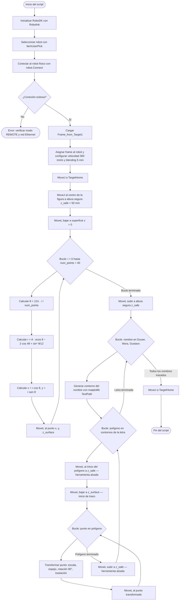

<div align="center">


<a href="https://robodk.com/"></a>
<a href="https://www.motoman.com/en-us/products/robots/industrial/assembly-handling/mh-series/mh6"></a>
<a href="https://new.abb.com/products/robotics/robots/articulated-robots/irb-140"></a>
<a href="./LICENSE"></a>

</div>

---

<div align="center">

```
╔══════════════════════════════════════════════════════════════════╗
║  🤖  Análisis y Operación del Manipulador Motoman MH6            ║
║  Comparación  ·  Movimiento Manual  ·  RoboDK  ·  Trayectoria   ║
╚══════════════════════════════════════════════════════════════════╝
```

</div>

> **Resumen del laboratorio:** Práctica de laboratorio donde se analiza y opera el manipulador **Motoman MH6** de Yaskawa. Se realiza una comparación técnica con el ABB IRB140, se exploran los modos de operación manual, se estudia el software RoboDK y su comunicación con el manipulador, y se diseña y ejecuta una trayectoria polar tanto en simulación como en el robot físico.

---

## 📋 Tabla de contenidos

| # | Sección |
|---|---------|
| 1 | [📊 Cuadro comparativo Motoman MH6 vs IRB140](#-cuadro-comparativo-motoman-mh6-vs-irb140) |
| 2 | [🏠 Configuraciones Home1 y Home2 del Motoman MH6](#-configuraciones-home1-y-home2-del-motoman-mh6) |
| 3 | [🕹️ Movimientos manuales — procedimiento y teclas](#️-movimientos-manuales--procedimiento-y-teclas) |
| 4 | [⚡ Niveles de velocidad para movimiento manual](#-niveles-de-velocidad-para-movimiento-manual) |
| 5 | [💻 Software RoboDK — aplicaciones y comunicación](#-software-robodk--aplicaciones-y-comunicación) |
| 6 | [⚖️ Comparación RoboDK vs RobotStudio](#️-comparación-robodk-vs-robotstudio) |
| 7 | [🔁 Diagrama de flujo de acciones del robot](#-diagrama-de-flujo-de-acciones-del-robot) |
| 8 | [🗺️ Plano de planta](#️-plano-de-planta) |
| 9 | [🌀 Trayectoria polar — código y simulación](#-trayectoria-polar--código-y-simulación) |
| 10 | [🎥 Videos de simulación e implementación](#-videos-de-simulación-e-implementación) |
| 11 | [🧾 Autores](#-autores) |

---

## 📊 Cuadro comparativo Motoman MH6 vs IRB140

| Característica | Motoman MH6 | ABB IRB140 |
|---|---|---|
| **Fabricante** | Yaskawa | ABB |
| **Grados de libertad** | 6 | 6 |
| **Carga máxima** | 6 kg | 6 kg |
| **Alcance máximo** | 1 422 mm | 810 mm |
| **Repetibilidad** | ±0.08 mm | ±0.03 mm |
| **Peso del robot** | 130 kg | 98 kg |
| **Velocidad máx. eje 1** | 190°/s | 200°/s |
| **Velocidad máx. eje 2** | 190°/s | 200°/s |
| **Velocidad máx. eje 3** | 190°/s | 260°/s |
| **Velocidad máx. eje 4** | 380°/s | 360°/s |
| **Velocidad máx. eje 5** | 380°/s | 360°/s |
| **Velocidad máx. eje 6** | 550°/s | 450°/s |
| **Controlador** | DX100 / YRC1000 | IRC5 |
| **Lenguaje de programación** | PYTHON | RAPID |
| **Montaje** | Suelo, techo, pared | Suelo, techo, pared |
| **Aplicaciones típicas** | Manipulación, ensamble, soldadura, paletizado | Manipulación, ensamble, soldadura por arco, limpieza |
| **Grado de protección** | IP54 | IP54 |
| **Software de simulación** | RoboDK, MotoSim | RobotStudio |

---

## 🏠 Configuraciones Home1 y Home2 del Motoman MH6

El manipulador Motoman MH6 tiene dos posiciones de referencia predefinidas con propósitos distintos dentro del ciclo de operación. Los valores se expresan en **pulsos de encoder** (unidad interna del controlador DX100), no en grados.

### Home1 — "Work Home Position"

Es la posición de reposo principal del robot. Al alcanzarla, el manipulador se **recoge sobre sí mismo**, con los eslabones superpuestos verticalmente, minimizando el espacio ocupado en la celda.

| Articulación | Valor ORIGIN (pulsos) | Valor CURRENT (pulsos) |
|---|---|---|
| S (eje 1) | -115290 | -115290 |
| L (eje 2) | 0 | 0 |
| U (eje 3) | -111622 | -111623 |
| R (eje 4) | 1 | -1 |
| B (eje 5) | 42647 | 42647 |
| T (eje 6) | 1392 | 1393 |

### Home2 — "Second Home Position"

Es una posición de trabajo de referencia secundaria. El robot adopta una **configuración en L invertida**, con el brazo extendido y la herramienta a mayor altura apuntando hacia abajo, lista para iniciar ciclos de trabajo.

| Articulación | Valor SPECIFIED (pulsos) | Valor CURRENT (pulsos) | Diferencia |
|---|---|---|---|
| S (eje 1) | 0 | 0 | 0 |
| L (eje 2) | 2037 | 2037 | 0 |
| U (eje 3) | 2359 | 2359 | 0 |
| R (eje 4) | -121 | -121 | 0 |
| B (eje 5) | 0 | 0 | 0 |
| T (eje 6) | 1392 | 1392 | 0 |

### ¿Cuál posición es mejor?

**Home2 resulta más conveniente como punto de inicio de ciclos de trabajo**, por las siguientes razones:

- La herramienta ya se encuentra orientada hacia abajo y a una altura operativa, reduciendo el recorrido necesario para llegar a la primera posición de trazado.
- La configuración en L invertida aleja el brazo del cuerpo del robot, disminuyendo el riesgo de colisiones internas al iniciar movimientos.
- Las diferencias entre los valores *Specified* y *Current* son todas cero, lo que indica que el robot llegó con precisión exacta a esa posición, confirmando su estabilidad como referencia.

**Home1 es preferible como posición de reposo y seguridad**, ya que al recoger todos los eslabones minimiza el espacio ocupado y reduce el par gravitacional sobre las articulaciones durante paradas prolongadas.

---

## 🕹️ Movimientos manuales — procedimiento y teclas

El pendant DX100 del Motoman MH6 permite operar en distintos modos de movimiento manual. La tecla central para gestionar esto es **COORD** (Coordenadas).

### Cambio entre modos de movimiento

| Modo | Descripción | Tecla de acceso |
|---|---|---|
| **JOINT (Articular)** | Mueve cada eje de forma independiente. S, L, U, R, B, T | Presionar **COORD** hasta seleccionar `JOINT` |
| **RECTANGULAR (Cartesiano)** | Mueve el TCP en el espacio cartesiano absoluto (X, Y, Z) | Presionar **COORD** hasta seleccionar `RECTANGULAR` |
| **CYLINDRICAL** | Movimiento en coordenadas cilíndricas | Presionar **COORD** hasta seleccionar `CYLINDRICAL` |
| **TOOL** | Movimiento relativo a la herramienta activa | Presionar **COORD** hasta seleccionar `TOOL` |

Cada vez que se presiona **COORD** el sistema rota cíclicamente entre los modos disponibles. El modo activo se indica en el **área de estado** de la pantalla del pendant.

### Traslaciones en ejes X, Y, Z (modo RECTANGULAR)

Una vez seleccionado el modo `RECTANGULAR`:

1. Activar los servomotores manteniendo presionado el **interruptor de hombre muerto** (Dead Man Switch) en el dorso del pendant.
2. Usar las **teclas de ejes** del pendant:

| Eje | Dirección positiva | Dirección negativa |
|---|---|---|
| X | Tecla `X+` | Tecla `X-` |
| Y | Tecla `Y+` | Tecla `Y-` |
| Z | Tecla `Z+` | Tecla `Z-` |

### Rotaciones en ejes X, Y, Z (modo RECTANGULAR)

En el mismo modo `RECTANGULAR`, las rotaciones del TCP se controlan con:

| Eje | Rotación positiva | Rotación negativa |
|---|---|---|
| Rx | Tecla `Rx+` | Tecla `Rx-` |
| Ry | Tecla `Ry+` | Tecla `Ry-` |
| Rz | Tecla `Rz+` | Tecla `Rz-` |

> En modo JOINT, las mismas teclas controlan directamente cada articulación: S, L, U, R, B, T en sus direcciones positiva y negativa.

---

## ⚡ Niveles de velocidad para movimiento manual

### Niveles disponibles

El Motoman MH6 con controlador DX100 dispone de **8 niveles de velocidad** para movimiento manual, organizados de menor a mayor:

| Nivel | Denominación | Descripción |
|---|---|---|
| 1 | **INCHING** | Movimiento mínimo paso a paso — máxima precisión |
| 2 | **LOW LOW** | Velocidad muy baja |
| 3 | **LOW** | Velocidad baja |
| 4 | **MEDIUM LOW** | Velocidad media-baja |
| 5 | **MEDIUM** | Velocidad media |
| 6 | **MEDIUM HIGH** | Velocidad media-alta |
| 7 | **HIGH** | Velocidad alta |
| 8 | **FULL SPEED** | Velocidad máxima permitida en modo manual |

### ¿Cómo se cambia el nivel de velocidad?

El cambio de velocidad se realiza mediante las teclas de **flecha arriba** y **flecha abajo** ubicadas en el lateral izquierdo del pendant DX100:

- **Flecha arriba (▲):** incrementa un nivel de velocidad.
- **Flecha abajo (▼):** reduce un nivel de velocidad.

El cambio es inmediato y no requiere detener el movimiento en curso.

### ¿Cómo se identifica el nivel en la pantalla?

El nivel de velocidad activo se muestra en el **área de estado** de la pantalla del pendant, en la esquina superior, mediante un indicador numérico o la etiqueta del nivel (LOW, MEDIUM, HIGH, etc.). El valor se actualiza en tiempo real cada vez que se presiona una tecla de cambio de velocidad.

---

## 💻 Software RoboDK — aplicaciones y comunicación

### Principales aplicaciones

RoboDK es una plataforma de simulación y programación offline compatible con más de 500 modelos de robots industriales de distintos fabricantes. Sus principales aplicaciones incluyen:

- **Simulación offline:** permite programar y simular trayectorias sin necesidad de conectarse al robot físico, reduciendo tiempos de paro en producción.
- **Programación independiente del fabricante:** genera código nativo para distintos robots (RAPID para ABB, INFORM para Yaskawa, KRL para KUKA, entre otros) desde un único entorno.
- **Post-procesadores personalizables:** adapta el código generado al controlador específico de cada robot mediante post-procesadores configurables.
- **Integración con Python:** permite automatizar rutinas, generar trayectorias complejas y controlar el robot en tiempo real mediante scripts Python a través de la API de RoboDK.
- **Control en tiempo real:** en modo conectado, RoboDK puede enviar comandos directamente al controlador del robot para ejecutar movimientos desde el PC.
- **Calibración y análisis de alcance:** herramientas para verificar que las trayectorias estén dentro del espacio de trabajo y evitar singularidades.

### ¿Cómo se comunica RoboDK con el manipulador Motoman?

RoboDK establece comunicación con el Motoman MH6 a través de una conexión **Ethernet (TCP/IP)** entre el PC y el controlador DX100. El proceso es el siguiente:

1. El PC con RoboDK y el controlador DX100 del Motoman se conectan a la misma red local.
2. El controlador debe estar configurado en **modo REMOTE** (selector de modo en el pendant en posición REMOTE).
3. RoboDK utiliza un **driver específico para Yaskawa/Motoman** que traduce los comandos al protocolo del controlador.
4. En el código Python, la conexión se establece explícitamente con `robot.Connect()` y se verifica con `robot.ConnectedState()`.
5. RoboDK envía instrucciones de posición (`MoveJ`, `MoveL`) al controlador, quien las convierte en movimientos de los servomotores articulación por articulación.

### ¿Qué hace RoboDK para mover el manipulador?

RoboDK calcula la **cinemática inversa** de cada punto de la trayectoria, determina los ángulos articulares necesarios y los transmite al controlador a través del driver de comunicación. El controlador DX100 ejecuta los movimientos interpolando entre puntos sucesivos, controlando la velocidad de cada eje y gestionando la seguridad del movimiento.

---

## ⚖️ Comparación RoboDK vs RobotStudio

| Aspecto | RoboDK | RobotStudio |
|---|---|---|
| **Fabricante** | RoboDK Inc. | ABB |
| **Compatibilidad de robots** | +500 marcas y modelos | Exclusivo para robots ABB |
| **Lenguaje nativo** | Python (API) + post-procesadores | RAPID |
| **Licenciamiento** | De pago con versión de prueba gratuita | Gratuito para simulación básica |
| **Curva de aprendizaje** | Media — interfaz intuitiva | Media-alta — mayor profundidad para ABB |
| **Fidelidad de simulación** | Alta — cinemática real del robot | Muy alta — gemelo digital certificado por ABB |
| **Control en tiempo real** | Sí, mediante driver y Ethernet | Sí, mediante OPC-UA y otros protocolos |
| **Generación de código** | Código nativo para múltiples fabricantes | Solo RAPID para ABB |
| **Uso típico** | Entornos multi-marca, educación, integración rápida | Celdas ABB de alta precisión, gemelo digital |

### ¿Qué significa cada herramienta?

**RoboDK** representa una solución de programación offline **universal e independiente del fabricante**. Su principal valor es la flexibilidad: permite trabajar con robots de distintas marcas desde un único entorno y automatizar trayectorias complejas mediante Python, como se demostró en este laboratorio con la generación de la curva de la mariposa y el trazado de nombres mediante la librería `matplotlib.textpath`.

**RobotStudio** representa el entorno oficial de ABB, orientado a obtener el **máximo nivel de fidelidad y precisión** para robots de esa marca. Al ser desarrollado por el mismo fabricante, ofrece un gemelo digital exacto del robot real y acceso completo a todas las funcionalidades del controlador IRC5. Fue la herramienta utilizada en el Laboratorio 01 con el IRB140.

---

## 🔁 Diagrama de flujo de acciones del robot





---

## 🗺️ Plano de planta

> ⚠️ *Adjuntar imagen o archivo PDF con el plano de planta de la celda, indicando la ubicación del Motoman MH6, el PC de control, la conexión Ethernet y los elementos periféricos.*

---

## 🌀 Trayectoria polar — código y simulación

### Fundamento matemático

Una **curva polar** se define mediante una función de la forma `r = f(θ)`, donde `r` es la distancia al origen y `θ` es el ángulo. Para este laboratorio se implementó una **rosa polar** definida por:

```
r(θ) = a · cos(k · θ)
```

Donde `a` define la amplitud y `k` el número de pétalos. La conversión a coordenadas cartesianas se realiza mediante:

```
x = r(θ) · cos(θ)
y = r(θ) · sen(θ)
```

### Código Python desarrollado en RoboDK

> ⚠️ *El código completo se encuentra adjunto en el repositorio. A continuación se muestra la estructura general.*

```python
from robodk.robolink import *
from robodk.robomath import *
import numpy as np

# Inicializar RoboDK
RDK = Robolink()

# Seleccionar el robot
robot = RDK.Item('Motoman MH6', ITEM_TYPE_ROBOT)

# Parámetros de la trayectoria polar
# r(θ) = a * cos(k * θ)
a = 150      # amplitud en mm
k = 3        # número de pétalos
n_puntos = 360
z_trabajo = 300  # altura de trabajo en mm

# Generar puntos de la trayectoria
thetas = np.linspace(0, 2 * np.pi, n_puntos)

for theta in thetas:
    r = a * np.cos(k * theta)
    x = r * np.cos(theta)
    y = r * np.sin(theta)
    z = z_trabajo

    # Definir pose cartesiana
    pose = transl(x, y, z)

    # Mover el robot al punto
    robot.MoveL(pose)

print("Trayectoria polar completada.")
```

> El código completo con parámetros exactos, configuración del TCP y gestión de errores se encuentra en el archivo adjunto dentro del repositorio.

### Nombres de los integrantes del equipo

> ⚠️ *Completar con los nombres reales del equipo.*

| Integrante | Rol |
|---|---|
| — | — |
| — | — |

---

## 🎥 Videos de simulación e implementación

> **Video de simulación en RoboDK.**

<div align="center">

<a href="#">
  
</a>

</div>

> **Video de implementación física en el Motoman MH6.**

<div align="center">

<a href="#">
  
</a>

</div>

---

## 🧾 Autores

<div align="center">

| Integrante | GitHub |
|---|---|
| — | — |
| — | — |

</div>

---

<div align="center">


</div>
