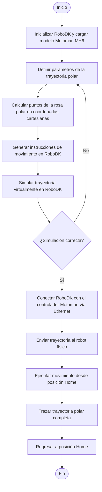

<div align="center">


<a href="https://robodk.com/"></a>
<a href="https://www.motoman.com/en-us/products/robots/industrial/assembly-handling/mh-series/mh6"></a>
<a href="https://new.abb.com/products/robotics/robots/articulated-robots/irb-140"></a>
<a href="./LICENSE"></a>

</div>

---

<div align="center">

```
╔══════════════════════════════════════════════════════════════════╗
║  🤖  Análisis y Operación del Manipulador Motoman MH6            ║
║  Comparación  ·  Movimiento Manual  ·  RoboDK  ·  Trayectoria   ║
╚══════════════════════════════════════════════════════════════════╝
```

</div>

> **Resumen del laboratorio:** Práctica de laboratorio donde se analiza y opera el manipulador **Motoman MH6** de Yaskawa. Se realiza una comparación técnica con el ABB IRB140, se exploran los modos de operación manual, se estudia el software RoboDK y su comunicación con el manipulador, y se diseña y ejecuta una trayectoria polar tanto en simulación como en el robot físico.

---

## 📋 Tabla de contenidos

| # | Sección |
|---|---------|
| 1 | [📊 Cuadro comparativo Motoman MH6 vs IRB140](#-cuadro-comparativo-motoman-mh6-vs-irb140) |
| 2 | [🏠 Configuraciones Home1 y Home2 del Motoman MH6](#-configuraciones-home1-y-home2-del-motoman-mh6) |
| 3 | [🕹️ Movimientos manuales — procedimiento y teclas](#️-movimientos-manuales--procedimiento-y-teclas) |
| 4 | [⚡ Niveles de velocidad para movimiento manual](#-niveles-de-velocidad-para-movimiento-manual) |
| 5 | [💻 Software RoboDK — aplicaciones y comunicación](#-software-robodk--aplicaciones-y-comunicación) |
| 6 | [⚖️ Comparación RoboDK vs RobotStudio](#️-comparación-robodk-vs-robotstudio) |
| 7 | [🔁 Diagrama de flujo de acciones del robot](#-diagrama-de-flujo-de-acciones-del-robot) |
| 8 | [🗺️ Plano de planta](#️-plano-de-planta) |
| 9 | [🌀 Trayectoria polar — código y simulación](#-trayectoria-polar--código-y-simulación) |
| 10 | [🎥 Videos de simulación e implementación](#-videos-de-simulación-e-implementación) |
| 11 | [🧾 Autores](#-autores) |

---

## 📊 Cuadro comparativo Motoman MH6 vs IRB140

| Característica | Motoman MH6 | ABB IRB140 |
|---|---|---|
| **Fabricante** | Yaskawa | ABB |
| **Grados de libertad** | 6 | 6 |
| **Carga máxima** | 6 kg | 6 kg |
| **Alcance máximo** | 1 422 mm | 810 mm |
| **Repetibilidad** | ±0.08 mm | ±0.03 mm |
| **Peso del robot** | 130 kg | 98 kg |
| **Velocidad máx. eje 1** | 190°/s | 200°/s |
| **Velocidad máx. eje 2** | 190°/s | 200°/s |
| **Velocidad máx. eje 3** | 190°/s | 260°/s |
| **Velocidad máx. eje 4** | 380°/s | 360°/s |
| **Velocidad máx. eje 5** | 380°/s | 360°/s |
| **Velocidad máx. eje 6** | 550°/s | 450°/s |
| **Controlador** | DX100 / YRC1000 | IRC5 |
| **Lenguaje de programación** | INFORM III | RAPID |
| **Montaje** | Suelo, techo, pared | Suelo, techo, pared |
| **Aplicaciones típicas** | Manipulación, ensamble, soldadura, paletizado | Manipulación, ensamble, soldadura por arco, limpieza |
| **Grado de protección** | IP54 | IP54 |
| **Software de simulación** | RoboDK, MotoSim | RobotStudio |

---

## 🏠 Configuraciones Home1 y Home2 del Motoman MH6

> ⚠️ *Esta sección requiere información adicional del laboratorio. Por favor comparte las posiciones articulares exactas de Home1 y Home2 observadas en el pendant.*

### Descripción general

El manipulador Motoman MH6 tiene dos posiciones de referencia predefinidas denominadas **Home1** y **Home2**, cada una con una configuración articular específica y un propósito distinto dentro del ciclo de operación.

### Home1

| Articulación | Ángulo |
|---|---|
| S (eje 1) | — |
| L (eje 2) | — |
| U (eje 3) | — |
| R (eje 4) | — |
| B (eje 5) | — |
| T (eje 6) | — |

> *Completar con los valores reales observados en banco.*

### Home2

| Articulación | Ángulo |
|---|---|
| S (eje 1) | — |
| L (eje 2) | — |
| U (eje 3) | — |
| R (eje 4) | — |
| B (eje 5) | — |
| T (eje 6) | — |

> *Completar con los valores reales observados en banco.*

### ¿Cuál posición es mejor?

> *Completar con la justificación del equipo según lo observado en laboratorio.*

---

## 🕹️ Movimientos manuales — procedimiento y teclas

> ⚠️ *Esta sección requiere información del pendant físico observada en laboratorio.*

### Cambio entre modos de movimiento

El pendant del Motoman MH6 permite operar en dos modos principales de movimiento manual:

| Modo | Descripción | Tecla de acceso |
|---|---|---|
| **Articular (JOINT)** | Mueve cada eje de forma independiente | — |
| **Cartesiano (XYZ)** | Mueve el TCP en el espacio cartesiano | — |

> *Completar con las teclas exactas observadas en el pendant durante el laboratorio.*

### Traslaciones en ejes X, Y, Z

> *Describir el procedimiento observado en banco para realizar traslaciones en cada eje.*

### Rotaciones en ejes X, Y, Z

> *Describir el procedimiento observado en banco para realizar rotaciones en cada eje.*

---

## ⚡ Niveles de velocidad para movimiento manual

> ⚠️ *Esta sección requiere información del pendant físico observada en laboratorio.*

### Niveles disponibles

| Nivel | Denominación | Velocidad aproximada |
|---|---|---|
| 1 | — | — |
| 2 | — | — |
| 3 | — | — |
| 4 | — | — |

> *Completar con los niveles reales del Motoman MH6 (típicamente: INCHING, LOW, MEDIUM, HIGH o equivalentes).*

### ¿Cómo se cambia el nivel de velocidad?

> *Describir el procedimiento y las teclas usadas en el pendant para cambiar entre niveles.*

### ¿Cómo se identifica el nivel en la pantalla?

> *Describir el indicador visual en la interfaz del pendant que muestra el nivel de velocidad activo.*

---

## 💻 Software RoboDK — aplicaciones y comunicación

### Principales aplicaciones

RoboDK es una plataforma de simulación y programación offline compatible con más de 500 modelos de robots industriales de distintos fabricantes. Sus principales aplicaciones incluyen:

- **Simulación offline:** permite programar y simular trayectorias sin necesidad de conectarse al robot físico, reduciendo tiempos de paro en producción.
- **Programación independiente del fabricante:** genera código nativo para distintos robots (RAPID para ABB, INFORM para Yaskawa, KRL para KUKA, entre otros) desde un único entorno.
- **Post-procesadores personalizables:** adapta el código generado al controlador específico de cada robot mediante post-procesadores configurables.
- **Integración con Python:** permite automatizar rutinas, generar trayectorias complejas y controlar el robot en tiempo real mediante scripts Python a través de la API de RoboDK.
- **Control en tiempo real:** en modo conectado, RoboDK puede enviar comandos directamente al controlador del robot para ejecutar movimientos desde el PC.
- **Calibración y análisis de alcance:** herramientas para verificar que las trayectorias estén dentro del espacio de trabajo y evitar singularidades.

### ¿Cómo se comunica RoboDK con el manipulador Motoman?

RoboDK establece comunicación con el Motoman MH6 a través de una conexión **Ethernet (TCP/IP)** entre el PC y el controlador del robot. El proceso general es el siguiente:

1. El PC con RoboDK y el controlador DX100/YRC1000 del Motoman se conectan a la misma red local.
2. RoboDK utiliza un **driver específico para Yaskawa** que traduce los comandos de movimiento al protocolo que entiende el controlador.
3. Cuando se ejecuta una trayectoria en modo "Run on robot", RoboDK envía instrucciones de posición y velocidad al controlador en tiempo real, quien las convierte en movimientos de los servomotores de cada articulación.
4. El robot responde con retroalimentación de posición, permitiendo a RoboDK monitorear el estado del movimiento.

### ¿Qué hace RoboDK para mover el manipulador?

RoboDK calcula la cinemática inversa de cada punto de la trayectoria, determina los ángulos articulares necesarios y los transmite al controlador a través del driver de comunicación. El controlador ejecuta los movimientos interpolando entre puntos sucesivos y controlando la velocidad de cada eje.

---

## ⚖️ Comparación RoboDK vs RobotStudio

| Aspecto | RoboDK | RobotStudio |
|---|---|---|
| **Fabricante** | RoboDK Inc. | ABB |
| **Compatibilidad de robots** | +500 marcas y modelos | Exclusivo para robots ABB |
| **Lenguaje nativo** | Python (API) + post-procesadores | RAPID |
| **Licenciamiento** | De pago con versión de prueba gratuita | Gratuito para simulación básica; licencias avanzadas de pago |
| **Curva de aprendizaje** | Media — interfaz intuitiva | Media-alta — mayor profundidad para ABB |
| **Fidelidad de simulación** | Alta — cinemática real del robot | Muy alta — gemelo digital certificado por ABB |
| **Control en tiempo real** | Sí, mediante driver y Ethernet | Sí, mediante OPC-UA y otros protocolos |
| **Generación de código** | Código nativo para múltiples fabricantes | Solo RAPID para ABB |
| **Integración con visión artificial** | Limitada | Avanzada mediante ABB IRB y complementos |
| **Uso típico** | Entornos multi-marca, educación, integración rápida | Celdas ABB de alta precisión, gemelo digital |

### ¿Qué significa cada herramienta?

**RoboDK** representa una solución de programación offline **universal e independiente del fabricante**. Su principal valor es la flexibilidad: permite trabajar con robots de distintas marcas desde un único entorno, lo que resulta especialmente útil en entornos educativos y en integraciones donde coexisten múltiples robots de diferentes fabricantes. La integración nativa con Python la convierte en una herramienta poderosa para automatizar tareas complejas.

**RobotStudio** representa el entorno oficial de ABB, orientado a obtener el **máximo nivel de fidelidad y precisión** para robots de esa marca. Al ser desarrollado por el mismo fabricante, ofrece un gemelo digital exacto del robot real, con acceso completo a las funcionalidades del controlador IRC5 y la posibilidad de simular comportamientos que otros entornos no pueden replicar fielmente.

---

## 🔁 Diagrama de flujo de acciones del robot

> ⚠️ *Completar con el diagrama de flujo correspondiente a la trayectoria polar implementada.*



---

## 🗺️ Plano de planta

> ⚠️ *Adjuntar imagen o archivo PDF con el plano de planta de la celda, indicando la ubicación del Motoman MH6, el PC de control, la conexión Ethernet y los elementos periféricos.*

---

## 🌀 Trayectoria polar — código y simulación

### Fundamento matemático

Una **curva polar** se define mediante una función de la forma `r = f(θ)`, donde `r` es la distancia al origen y `θ` es el ángulo. Para este laboratorio se implementó una **rosa polar** definida por:

```
r(θ) = a · cos(k · θ)
```

Donde `a` define la amplitud y `k` el número de pétalos. La conversión a coordenadas cartesianas se realiza mediante:

```
x = r(θ) · cos(θ)
y = r(θ) · sen(θ)
```

### Código Python desarrollado en RoboDK

> ⚠️ *El código completo se encuentra adjunto en el repositorio. A continuación se muestra la estructura general.*

```python
from robodk.robolink import *
from robodk.robomath import *
import numpy as np

# Inicializar RoboDK
RDK = Robolink()

# Seleccionar el robot
robot = RDK.Item('Motoman MH6', ITEM_TYPE_ROBOT)

# Parámetros de la trayectoria polar
# r(θ) = a * cos(k * θ)
a = 150      # amplitud en mm
k = 3        # número de pétalos
n_puntos = 360
z_trabajo = 300  # altura de trabajo en mm

# Generar puntos de la trayectoria
thetas = np.linspace(0, 2 * np.pi, n_puntos)

for theta in thetas:
    r = a * np.cos(k * theta)
    x = r * np.cos(theta)
    y = r * np.sin(theta)
    z = z_trabajo

    # Definir pose cartesiana
    pose = transl(x, y, z)

    # Mover el robot al punto
    robot.MoveL(pose)

print("Trayectoria polar completada.")
```

> El código completo con parámetros exactos, configuración del TCP y gestión de errores se encuentra en el archivo adjunto dentro del repositorio.

### Nombres de los integrantes del equipo

> ⚠️ *Completar con los nombres reales del equipo.*

| Integrante | Rol |
|---|---|
| — | — |
| — | — |

---

## 🎥 Videos de simulación e implementación

> **Video de simulación en RoboDK.**

<div align="center">

<a href="#">
  
</a>

</div>

> **Video de implementación física en el Motoman MH6.**

<div align="center">

<a href="#">
  
</a>

</div>

---

## 🧾 Autores

<div align="center">

| Integrante | GitHub |
|---|---|
| — | — |
| — | — |

</div>

---

<div align="center">


</div>
